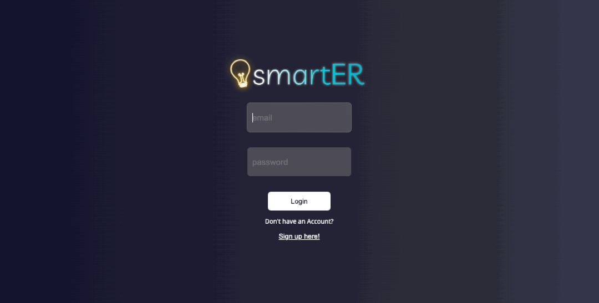
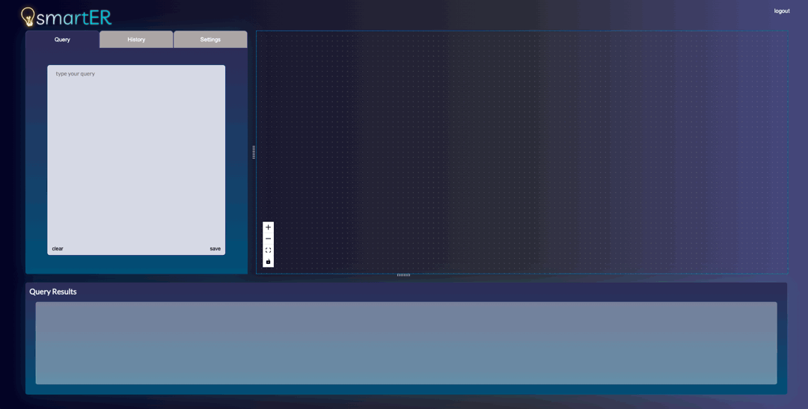
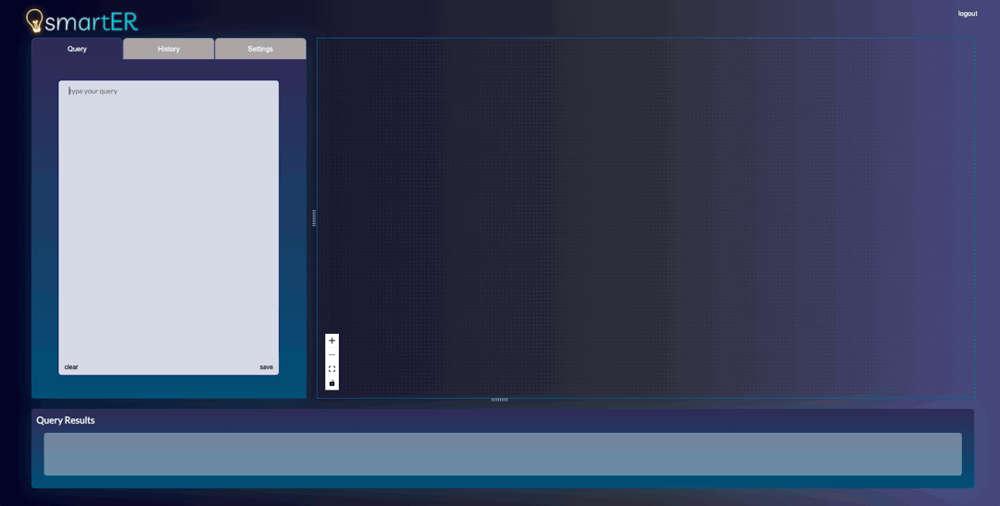
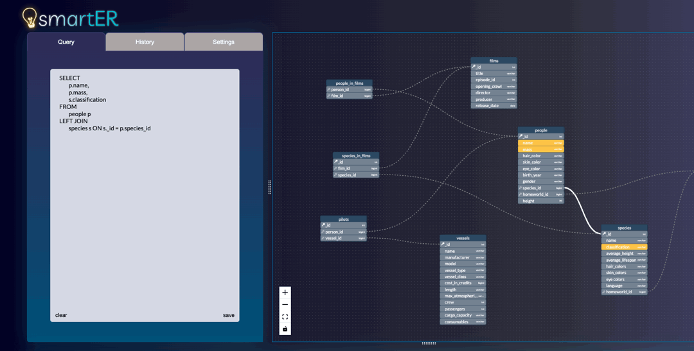

<p align="center">
   
</p>
<br>
<div align="center">
&nbsp;&nbsp;
&nbsp;&nbsp;
&nbsp;&nbsp;
&nbsp;&nbsp;
&nbsp;&nbsp;
&nbsp;&nbsp;

</div>
<br>
<div align="center">
  <a href="#getting-started">⚡ Getting Started</a>&nbsp;&nbsp;
  <a href="#user-guide">📝 User guide</a>&nbsp;&nbsp;
  <a href="#features">📬 Features</a>&nbsp;&nbsp;
  <a href="#how-to-contribute">🧠 How to contribute</a>&nbsp;&nbsp;
  <a href="#contributors">👥 Contributors</a>&nbsp;&nbsp;
  <a href="#supporters">☕️ Supporters</a>&nbsp;&nbsp;
</div>

<br>

<p>
SQL databases often contain a complex network of interconnected tables.  This can pose a challenge for developers when attempting to build or optimize queries that involve multiple tables.

<strong>smartER </strong> is a query visualizing tool that works with your postgreSQL database to provide dynamically rendered ER diagrams. It is a web application written in TypeScript that reads a user's database schema and renders ER diagrams based on a given query string. To parse through SQL schemas, it uses the <a href="https://www.npmjs.com/package/pgsql-ast-parser">pgsql-ast-parser </a> to produce a typed Abstract Syntax Tree, which is further parsed to build custom nodes with React Flow and finally position them using <a href="https://github.com/kieler/elkjs">elkjs</a>.

</p>

<h1> 🛠 Built With </h1>

- <a href="https://react.dev/learn"> React </a>
- <a href="https://www.typescriptlang.org/docs/handbook/jsx.html"> TypeScript </a>
- <a href="https://www.postgresql.org/docs/"> PostgreSQL </a>
- <a href="https://expressjs.com/en/api.html"> Express </a>
- <a href="https://sass-lang.com/documentation/"> Sass </a>
- <a href="https://redis.io/docs/"> Redis </a>
- <a href="https://reactflow.dev/docs/examples/overview/"> React Flow </a>

<h1 id="getting-started">⚡ Getting started </h1>
Our application is pretty simple to get up and running!

Install redis:

```js
brew install redis
```

Install other dependencies:

```js
npm install
```

Set up your database. Ours looks like this:<br>


Set your .env variables:

<ul>
  <li>DATABASE_API</li>
  <li>PORT</li>
  <li>JWT_SECRET_KEY</li>
  <li>URI_SECRET_KEY</li>
</ul>
<br>
Start the application:

```js
npm start
```

<h1 id="user-guide"> 📝 User guide </h1>

On application load, the user will be prompted to log in before being directed to the homepage. First time users should first create an account



Navigate to the settings tab and input either the URI or credentials for your database


Once the database is connected, navigate to the query tab and begin typing your query - notice your ER diagram renders and updates as you type!


Scroll through your query results at any time, they are rendered as you type as well


Save your query and re-render it later by clicking on it in the History tab


<h1 id="features">📬 Features:</h1>

smartER aims to provide a seamless user experience, offering:
- Automatic rendering based on a valid query string, with helpful error messages for invalid query strings
- Linking of relationships in the ER diagram via a dotted line
- Linking of JOIN columns from your query with a bolded line
- Highlighting of all columns in your SELECT statement for visual clarity and accessibility
- Support for all postgreSQL SELECT queries, including unions, subqueries, and aggregations
- An interactive and easily rearranged ER diagram for optimal clarity on your database relationships
- A responsive UI that allows the user to decide which features get the most real estate

<h1 id="how-to-contribute">🧠 How to contribute </h1>

<p> smartER is currently in alpha and we would love to hear your feedback, encouragement, advice, suggestions, or problems. If you would like to contribute, please fork, clone, and make pull requests. If you would like to report an issue or submit a feature request, please do so.  We would love to hear how we can make smartER more useful for you! If you would like to reach the smartER team directly for any other reason, please <a href="mailto:querysmarter@gmail.com">email us</a></p>

<h1 id="contributors">👥 Contributors</h1>

<p>Joyce Kwak <a  href='https://github.com/joyxek' target=“_blank”>@github </a><a  href='https://www.linkedin.com/in/joyce-kwak/' target=“_blank”>@linkedin</a></p>

<p>
Melissa McLaughlin <a  href='https://github.com/melissamcl' target=“_blank”>@github </a><a  href='https://www.linkedin.com/in/melissamcl/' target=“_blank”>@linkedin</a></p>

<p>Nathan Ngo <a  href='https://github.com/n8ngo' target=“_blank”>@github </a><a  href='https://www.linkedin.com/in/nathan-qh-ngo/' target=“_blank”>@linkedin</a></p>

<p>Brian Vu <a  href='https://github.com/b-v-u' target=“_blank”>@github </a><a  href='https://www.linkedin.com/in/briandoanvu/' target=“_blank”>@linkedin</a></p>

<h1 id="supporters">☕️ Supporters</h1>
