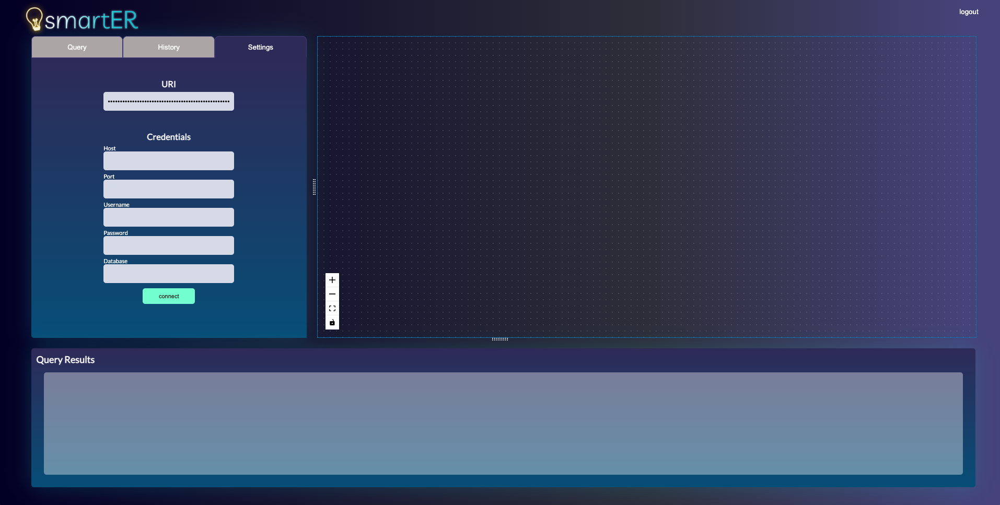

<p>
   
</p>
  
[⚡ Getting Started]() |
[📚 Documentation]() |
[⌨️ Blog]() |
[💬 Twitter](https://twitter.com) |
[💼 LinkedIn](https://www.linkedin.com)

<p>

    
    
    


</p>

<p>
SQL databases may contain a complex network of interconnected tables which can pose a challenge for developers when attempting to optimize queries that require traversing multiple relationships.

<b>smartER </b> is a query visualizing tool that works with your postgreSQL database to provide dynamically rendered ER diagrams. It is a web application that is written with TypeScript and works to read a user's database schema in order to render ER diagrams based on a specific input query string. In order to assist with parsing through SQL schemas, it uses the <a href="https://www.npmjs.com/package/pgsql-ast-parser">pgsql-ast-parser </a> to produce a typed Abstract Syntax Tree in order to work with building custon nodes with React Flow.

</p>

<h3> 🛠 Built With </h3>

- <a href="https://react.dev/learn"> React </a>
- <a href="https://www.typescriptlang.org/docs/handbook/jsx.html"> TypeScript </a>
- <a href="https://www.postgresql.org/docs/"> PostgreSQL </a>
- <a href="https://expressjs.com/en/api.html"> Express </a>
- <a href="https://sass-lang.com/documentation/"> Sass </a>
- <a href="https://redis.io/docs/"> Redis </a>
- <a href="https://reactflow.dev/docs/examples/overview/"> React Flow </a>

<h3> 📖 Table of Contents </h3>

<ul>
  <li>Getting started</li>
  <li>Usage Guidance</li>
  <li>How to contribute</li>
  <li>Contributers</li>
</ul>

<h3> Getting started </h3>

Our application is pretty simple to get up and running!

Install all dependencies:

```js
npm install
```

```js
npm start
```

Running start will direct you to your browser with smartER.

<h3> 📝 Usage Guidelines </h3>

On application load it will lead you to a login page. First time users will want to create an account to be redirected to the homepage.


Navigate to the settings tab and input either your URI for your database or connect with valid credentials.
 

Ensure that your usernames, passwords, and ports are accurate in the smartER settings.

Once the database is connected, navigate to the query tab and begin typing in your queries. Use the buttons within the query input box to either <i>clear</i> or <i>save</i> our query to your history.
<br >
<br >
SmartER is designed to render both your ER Diagram and query results as you are typing.


Navigate to the history tab to easily re-run past queries.


<h4> 📬 FEATURES: </h4>

In addition to being able to visualize a query, smartER aims to bring seemless visuals during user actions. smartER offers:

- Automatic rendering based on a valid query string
- In the ER Diagram, the primary and foreign keys are connected to one another with a dotted line
- Relevent columns from an executed query that contains SELECT statements are highlighted in yellow for visual accessibility
- Likewise, JOIN statements from an executed query appear with a bolded line connecting specified points
- Columns are easily rearranged by the user

<h3> How to contribute </h3>

<p> smartER is currently in alpha and we would love to hear your feedback, encouragement, advice, suggestions, or problems. If you would like to contribute, please contact us at ....</p>

<h3> Contributors </h3>

<p>Joyce Kwak</p><a  href='https://github.com/joyxek' target=“_blank”>@github </a><a  href='https://www.linkedin.com/in/leonardlew' target=“_blank”>@linkedin</a>

<p>
Melissa McLaughlin</p><a  href='https://github.com/melissamcl' target=“_blank”>@github </a><a  href='https://www.linkedin.com/in/melissamcl/' target=“_blank”>@linkedin</a>

<p>Nathan Ngo</p><a  href='https://github.com/n8ngo' target=“_blank”>@github </a><a  href='https://www.linkedin.com/in/nathan-qh-ngo/' target=“_blank”>@linkedin</a>

<p>Brian Vu</p><a  href='https://github.com/b-v-u' target=“_blank”>@github </a><a  href='https://www.linkedin.com/in/briandoanvu/' target=“_blank”>@linkedin</a>

<h3> ☕️ Supporters </h3>
